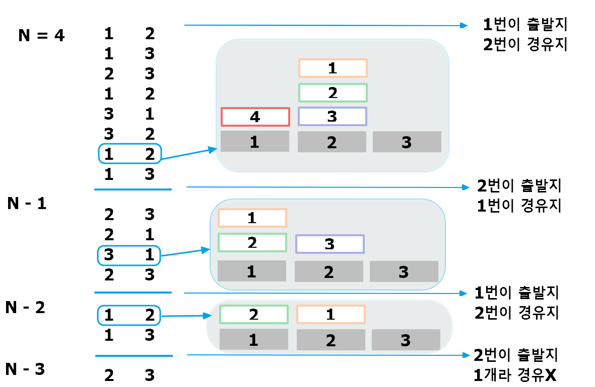

##  [💛 백준 11729 (하노이 탑 이동 순서) 💛](https://www.acmicpc.net/problem/11729)


### 메모

```
가장 무거운 원판을 옮기려면 N-1개의 원판이 경유지에 있어야함.
```

### 정리


### 내 답안
```java
// 한 층
class Floor {
    int x, y;

    Floor(int x, int y) {
        this.x = x;
        this.y = y;
    }

    @Override
    public String toString() {
        return x + " " + y + "\n";
    }
}

public class Main {

    static List<Floor> result = new ArrayList<>();

    public static void main(String[] args) throws IOException {
        BufferedReader br = new BufferedReader(new InputStreamReader(System.in));
        BufferedWriter bw = new BufferedWriter(new OutputStreamWriter(System.out));

        int N = Integer.parseInt(br.readLine());

        //(원판수, 출발지, 도착지, 경유지)
        Hanoi(N, 1, 3, 2);

        // 결과 출력
        bw.write(result.size() + "\n");
        for (Floor move : result) {
            bw.write(move.toString());
        }
        bw.flush();
        bw.close();
        
    }
    public static void Hanoi(int n, int from, int to, int inter) {
        if (n == 0) return;
        // N-1개의 원판을 출발지에서 경유지로 이동
        Hanoi(n - 1, from, inter, to);
        // 가장 큰 원판을 출발지에서 목적지로 이동
        result.add(new Floor(from, to));
        // N-1개의 원판을 경유지에서 목적지로 이동
        Hanoi(n - 1, inter, to, from);
    }
}

```
