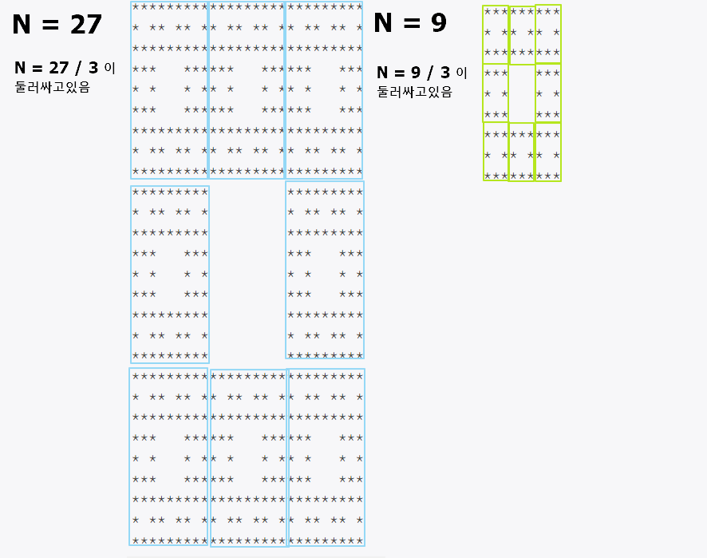

##  [💛 백준 2447 (별 찍기 - 10) 💛](https://www.acmicpc.net/problem/2447)


### 메모
```
2차원 배열로 만들어서 index 3등분 -> 가운데 비우기
```

### 정리


### 내 답안
```java
public class Main {

    static char[][] line;

    public static void main(String[] args) throws IOException {
        BufferedReader br = new BufferedReader(new InputStreamReader(System.in));
        BufferedWriter bw = new BufferedWriter(new OutputStreamWriter(System.out));

        int N = Integer.parseInt(br.readLine());

        line = new char[N][N];

        // 별 채우기
        for (int i = 0; i < N; i++) {
            for (int k = 0; k < N; k++) {
                line[i][k] = '*';
            }
        }

        blank(0, 0, N);

        // 결과 출력
        for (int i = 0; i < N; i++) {
            for (int k = 0; k < N; k++) {
                bw.write(line[i][k]);
            }
            bw.newLine();
        }
        bw.flush();
        bw.close();
        br.close();

    }

    // 공백 만들기
    public static void blank(int startX, int startY, int size) {

        if (size == 1) return;

        int newSize = size / 3;
        // 중간 공백 만들기
        for (int i = startX + newSize; i < startX + 2 * newSize; i++) {
            for (int k = startY + newSize; k < startY + 2 * newSize; k++) {
                line[i][k] = ' ';
            }
        }

        // 9분할해서 재귀 호출
        for (int i = 0; i < 3; i++) {
            for (int k = 0; k < 3; k++) {
                // 중앙이 아닌 부분만
                if (i != 1 || k != 1) {
                    blank(startX + i * newSize, startY + k * newSize, newSize);
                }
            }
        }

    }
}

```
